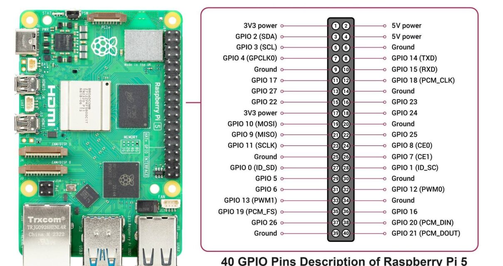
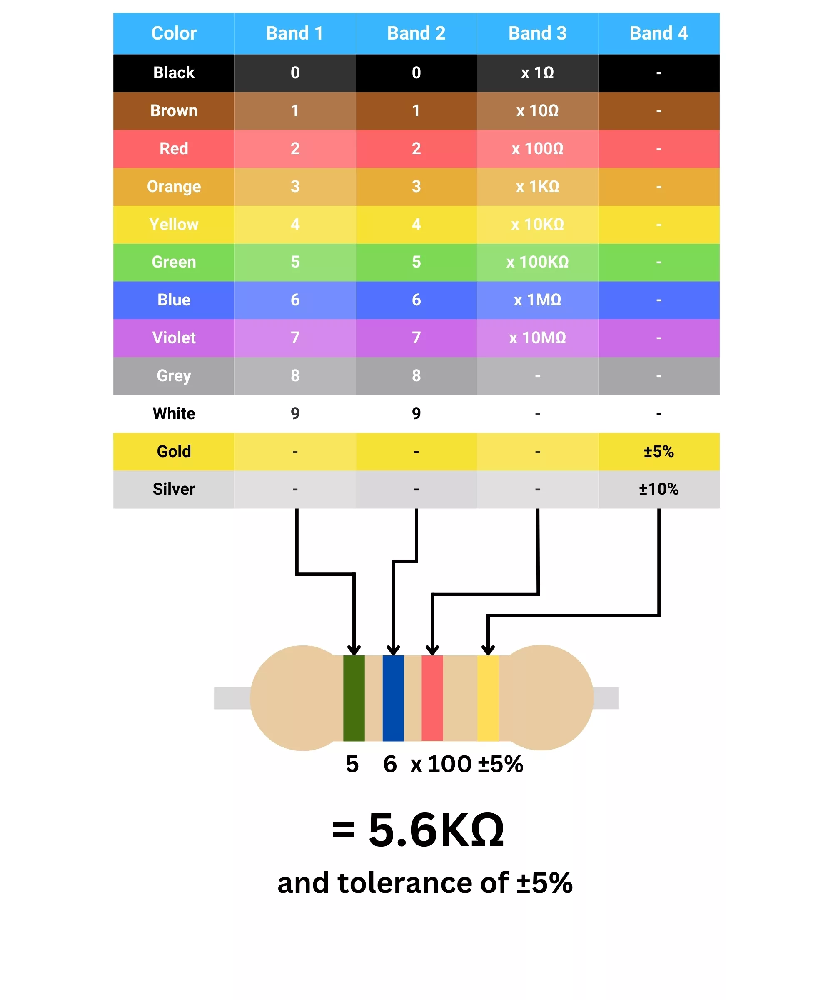
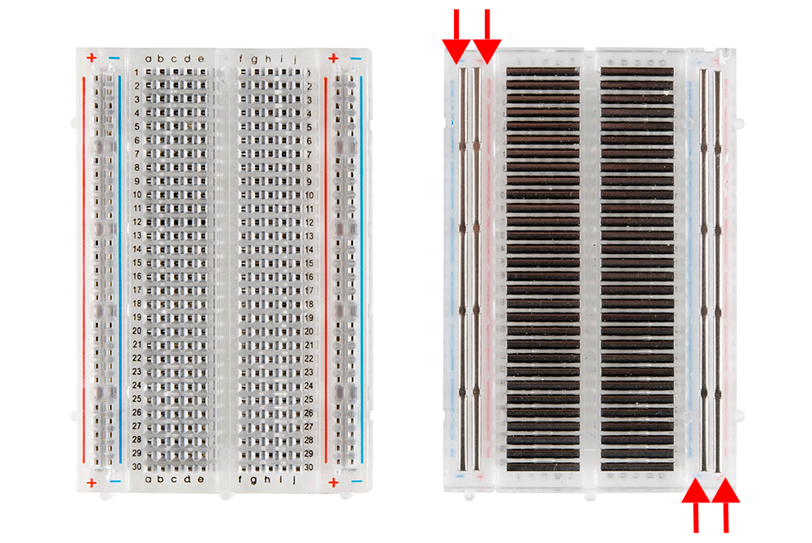
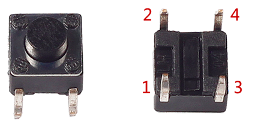
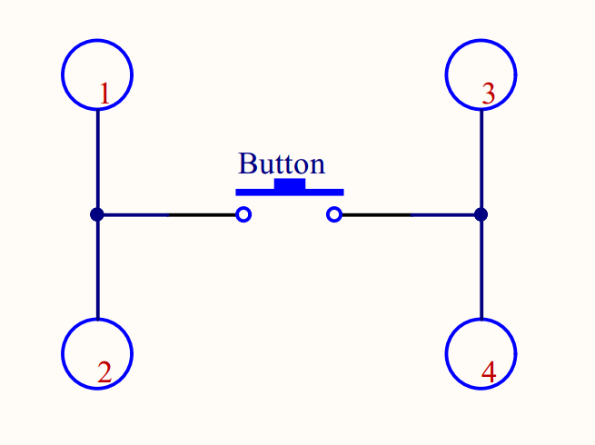

# Raspberry Pi — Basic Sensor Setups (Model 5)

A clean, beginner-friendly repo for wiring and reading common sensors on a Raspberry Pi **Model 5**. This doc starts with an ultrasonic distance sensor (HC-SR04 style) using the modern `lgpio` library.


Source: [https://hackatronic.com/wp-content/uploads/2024/03/Raspberry-Pi-5-Pinout--1210x642.jpg](https://hackatronic.com/wp-content/uploads/2024/03/Raspberry-Pi-5-Pinout--1210x642.jpg)


Source: [https://www.mitchelectronics.co.uk/images/resources/extra/resistor-chart.webp](https://www.mitchelectronics.co.uk/images/resources/extra/resistor-chart.webp)


Source: [https://learn.sparkfun.com/tutorials/how-to-use-a-breadboard/anatomy-of-a-breadboard](https://learn.sparkfun.com/tutorials/how-to-use-a-breadboard/anatomy-of-a-breadboard)

---

## Prerequisites

```bash
sudo apt update
sudo apt install -y python3-lgpio
```

If you get a permissions error on `/dev/gpiochip*`, either run with `sudo` or add your user to the `gpio` group and re-login:

```bash
sudo adduser $USER gpio
```

> We use **BCM numbering** in the examples below. (This is the GPIO numbering rather than the physical device pin numbers).
---

## 1) Simple LED blinking (Start simple, then make rockets)

### What this does (short version)

Toggles a Raspberry Pi **GPIO pin** between **HIGH (3.3 V)** and **LOW (0 V)** to turn an LED **on/off** through a **current-limiting resistor**.

### Parts

* 1× LED (any color)
* 1× **330 Ω** resistor (220–1 kΩ also works; 330 Ω is a good default)
* Breadboard + jumpers

### Why the resistor?

It limits current through the LED and protects the GPIO. With a red LED (~2.0 V drop):
Current ≈ (3.3 V − 2.0 V) / 330 Ω ≈ **4 mA** (safe & bright enough).
Rule of thumb: keep **well below ~16 mA per pin**; a few mA is plenty.

### Wiring (example: BCM GPIO 17)

| LED Lead                | Connects To                              | Notes                         |
| ----------------------- | ---------------------------------------- | ----------------------------- |
| **Long leg (anode)**    | **GPIO 17** → **through 330 Ω** resistor | BCM 17 is **physical pin 11** |
| **Short leg (cathode)** | **GND**                                  | e.g., physical **pin 6**      |

Schematic (source mode):

```
GPIO17 (pin 11) ──[330Ω]──►|── GND
                      LED
```

> Alternative (current sinking): 3.3 V → resistor → LED → **GPIO17**. Then write **LOW** to turn it **on**. The code below uses the **sourcing** style (HIGH = on).

---

### Python example (Raspberry Pi 5 + `lgpio`)

Save as `led_blink.py`:

```python
#!/usr/bin/env python3
import time
import lgpio  # sudo apt install python3-lgpio

CHIP = 0      # usually /dev/gpiochip0
LED  = 17     # BCM numbering (physical pin 11)

h = lgpio.gpiochip_open(CHIP)

# Claim LED as output, default LOW (off).
# Signature: gpio_claim_output(handle, line, lflags=0, default_val=0)
lgpio.gpio_claim_output(h, LED, 0, 0)

def blink(on=0.5, off=0.5, cycles=None):
    """
    Blink the LED with on/off durations (seconds).
    If cycles is None, run forever until Ctrl+C.
    """
    count = 0
    try:
        while True:
            lgpio.gpio_write(h, LED, 1)          # LED ON
            print(f"{time.strftime('%H:%M:%S')}  LED -> ON")
            time.sleep(on)

            lgpio.gpio_write(h, LED, 0)          # LED OFF
            print(f"{time.strftime('%H:%M:%S')}  LED -> OFF")
            time.sleep(off)

            if cycles is not None:
                count += 1
                if count >= cycles:
                    break
    except KeyboardInterrupt:
        print("\nCtrl+C - stopping.")
    finally:
        lgpio.gpio_write(h, LED, 0)              # ensure off

if __name__ == "__main__":
    print(f"Blinking BCM {LED} (physical pin 11). Press Ctrl+C to stop.")
    try:
        blink(on=0.5, off=0.5)  # 1 Hz blink
    finally:
        lgpio.gpiochip_close(h)
        print("GPIO chip closed.")
```

#### What the code is doing

1. **Setup**: Opens `/dev/gpiochip0` and claims **GPIO17** as an **output**, starting LOW.
2. **Blink loop**: Writes **1** (HIGH) and **0** (LOW) with `time.sleep()` delays; prints status so you can see it in the terminal.
3. **Cleanup**: Ensures the LED is off and closes the GPIO chip handle even if you hit **Ctrl+C**.

> Troubleshooting:
>
> * **Permission denied** on `/dev/gpiochip0`? Run with `sudo` or add your user to the `gpio` group:
>
>   ```
>   sudo adduser $USER gpio
>   ```
>
>   Log out/in afterwards.
> * LED not lighting? Flip the LED orientation; the **long leg** must be on the **GPIO/resistor** side.
> * Very dim? Try a **lower value** resistor (e.g., 220 Ω) or a **red/green** LED (blue/white have higher forward voltage).


---
## 2) Ultrasonic Distance Sensor (HC-SR04 class)

### What the sensor does (short version)

* The module **emits ultrasound** (~40 kHz) when you give its **TRIG** pin a short HIGH pulse (≥10 µs).
* It then raises **ECHO** HIGH for a duration proportional to the **round-trip time** of the sound wave.
* **You measure the pulse width on ECHO** to compute the distance:

  $$
  \text{distance (cm)} \approx \frac{\text{speed of sound} \times \text{time}}{2} \approx 17150 \times \text{time (s)}
  $$
* Typical range: **2–400 cm** (many hobby units are most reliable in the **2–80 cm** range).

### What kind of signals are involved?

* **TRIG (input to the sensor):** 3.3 V/5 V digital input. You provide a **10 µs HIGH pulse** to start a measurement.
* **ECHO (output from the sensor):** **digital pulse** (TTL-like). **HIGH-pulse width = time of flight.**

  * Many HC-SR04 boards drive ECHO at **5 V**. A Raspberry Pi GPIO **must not** see 5 V.
  * Use a **level shifter** or a simple **resistor divider** (e.g., 1 kΩ from ECHO to Pi GPIO + 2 kΩ from Pi GPIO to GND gives ~3.3 V from 5 V).

> The sensor does **not** output an analog voltage proportional to distance; it outputs a **digital timing pulse**.

### Wiring (example)

| Sensor Pin | Connects to (BCM) | Notes                                               |
| ---------- | ----------------- | --------------------------------------------------- |
| VCC        | 5 V               | Power for transducer & logic                        |
| GND        | GND               | Common ground                                       |
| TRIG       | GPIO **23**       | Pi drives this pin (3.3 V OK)                       |
| ECHO       | GPIO **24**       | **Use level shifting** (don’t feed 5 V into the Pi) |

---

## Python example (Raspberry Pi 5 + `lgpio`)

Save as `ultrasonic.py`:

```python
#!/usr/bin/env python3
import time
import lgpio  # sudo apt install python3-lgpio

CHIP = 0      # /dev/gpiochip0
TRIG = 23     # BCM numbering
ECHO = 24

h = lgpio.gpiochip_open(CHIP)

# Claim lines (flags=0). For output also set an initial level of 0 (LOW).
lgpio.gpio_claim_output(h, TRIG, 0, 0)
lgpio.gpio_claim_input(h, ECHO, 0)

def get_distance(timeout=0.03):
    """
    Returns distance in cm, or None on timeout.
    """
    # Ensure TRIG is LOW for a short settle period
    lgpio.gpio_write(h, TRIG, 0)
    time.sleep(0.002)

    # Send a 10 µs HIGH pulse on TRIG to start a measurement
    lgpio.gpio_write(h, TRIG, 1)
    time.sleep(10e-6)
    lgpio.gpio_write(h, TRIG, 0)

    # Wait for ECHO to go HIGH (start of measurement window)
    t0 = time.perf_counter()
    while lgpio.gpio_read(h, ECHO) == 0:
        if time.perf_counter() - t0 > timeout:
            return None

    pulse_start = time.perf_counter()

    # Wait for ECHO to go LOW (end of measurement window)
    while lgpio.gpio_read(h, ECHO) == 1:
        if time.perf_counter() - pulse_start > timeout:
            return None

    pulse_end = time.perf_counter()
    pulse_duration = pulse_end - pulse_start

    # Convert round-trip time to one-way distance (cm)
    # speed of sound ~34300 cm/s => divide by 2 => 17150
    return round(pulse_duration * 17150, 2)

if __name__ == "__main__":
    try:
        while True:
            dist = get_distance()
            if dist is None:
                print("Timeout: no echo")
            else:
                print(f"Measured distance = {dist:.2f} cm")
            time.sleep(0.1)
    except KeyboardInterrupt:
        pass
    finally:
        lgpio.gpiochip_close(h)
```

### What the code is doing (step-by-step)

1. **Setup**

   * Opens `/dev/gpiochip0` and claims **TRIG** as an **output** (initial LOW) and **ECHO** as an **input** so only this process uses those lines.

2. **Trigger a reading**

   * Forces **TRIG LOW** briefly to settle.
   * Sends a **10 µs HIGH** on **TRIG** to command the sensor to emit an ultrasonic burst.

3. **Measure the echo pulse**

   * Waits until **ECHO goes HIGH** (the sensor has sent the ping and is timing the return).
   * Records `pulse_start` when ECHO rises.
   * Waits until **ECHO returns LOW** and records `pulse_end`.
   * The **pulse width** (`pulse_end - pulse_start`) is the **round-trip time**.

4. **Convert to distance**

   * Multiplies the time by **17150** (cm/s ÷ 2) to get **centimeters**.
   * Returns `None` if either wait loop times out (no echo or object out of range).

5. **Loop & cleanup**

   * Repeats measurements ~10× per second, prints the result, and **always closes** the chip handle on exit.

> Tip: if noisy or inconsistent, try adding a small median filter over the last 3–5 readings, and keep cables short. Temperature & humidity slightly affect the speed of sound.

---
## 3) Passive infrared (PIR) motion sensor


---
## 4) Push Button





source: https://osoyoo.com/2025/04/23/push-button-control-a-led-bookwork-os-in-raspberry-pi-5/
